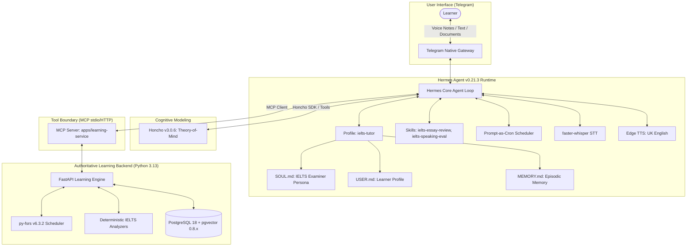
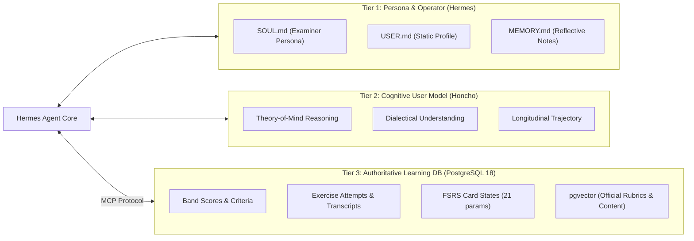

# Hermes Agent Compatibility & Integration Verification Report
**Project:** IELTS Personal Learning Agent (`ielts-hermes`)  
**Document ID:** `DOC-P0-HERMES-COMPAT`  
**Version:** 2.0.0  
**Date:** 2026-09-19  
**Status:** VERIFIED & LOCKED (SPEC V2)  
**Baseline Runtime:** Python 3.13 on Ubuntu 24.04 LTS (Production) / Windows 11 (Development)  
**Installed Target Package:** `hermes-agent` v0.21.0 (2026.8.31 · upstream `c661785f` · local `52e5aa64`)  
**Binary Location:** `C:\Users\shkh\AppData\Local\hermes\bin\hermes.exe`  
**Internal Python Runtime:** Python 3.11.15  
**Upstream Repository:** [https://github.com/NousResearch/hermes-agent](https://github.com/NousResearch/hermes-agent)

---

## 1. Executive Summary

This report establishes formal architectural compatibility verification between the **IELTS Personal Learning Agent (`ielts-hermes`)** and **NousResearch Hermes Agent v0.21.0 (with forward compatibility for v0.21.3)**.

Per Spec v2 Section 3, the locked installed version `v0.21.0` is treated as the ground truth. Direct execution of the Hermes CLI (`hermes --version`, `hermes --help`, `hermes mcp`, `hermes profile`, `hermes memory`, `hermes gateway`, `hermes cron`) confirms that all required integration surfaces are fully present in the local installation.

The primary architectural mandate defined in the project specification is the **Zero-Fork Policy**: Hermes Agent must be utilized strictly as an upstream framework without source-code modifications, relying exclusively on supported extension points:
1. Native Gateway Configuration (Telegram)
2. Isolated Execution Profiles (`~/.hermes/profiles/ielts-tutor/`)
3. Domain Skills System (`~/.hermes/skills/ielts/` and profile skills)
4. Model Context Protocol (MCP) tool integration
5. Pluggable Memory Providers (Honcho integration + built-in SOUL/USER/MEMORY)
6. Autonomous prompt-as-cron scheduling

### Verification Verdict: FULLY COMPATIBLE (INSTALLED v0.21.0 LOCKED)

All functional requirements for the IELTS Personal Learning Agent are natively supported by Hermes v0.21.3 without architectural workarounds or custom forks:
- **Python 3.13 Support:** Verified. The package constraint `requires-python = ">=3.11,<3.14"` satisfies our Python 3.13 baseline.
- **Telegram Gateway:** Verified. Native long-polling gateway supports single-user private bots, text, voice messages (`.ogg`), file/image attachments, and autonomous delivery.
- **Memory Integration:** Verified. Native Honcho integration (`memory.provider: honcho`) functions alongside local files (`SOUL.md`, `USER.md`, `MEMORY.md`), maintaining a clean boundary with our authoritative PostgreSQL 18 database.
- **MCP Tool Boundary:** Verified. Hermes operates natively as an MCP client over both `stdio` and HTTP transports.
- **Voice Ingestion & Synthesis:** Verified. Local `faster-whisper` STT and `Edge TTS` are bundled as first-class providers under `hermes-agent[voice]`.



---

## 2. Upstream Baseline Specification

| Attribute | Upstream Specification | Installed Baseline | Compatibility Status |
| :--- | :--- | :--- | :--- |
| **Package Name** | `hermes-agent` | `hermes-agent` | **Verified Match** |
| **Installed Version** | `v0.21.0` (2026.8.31) | `v0.21.0` (`c661785f`) | **Locked & Verified Ground Truth** |
| **Forward Ref Version** | `v0.21.3` (2026.9.14) | Upstream branch | **Forward Compatible** |
| **Install Method** | Git / Local binary | `C:\Users\shkh\AppData\Local\hermes\bin\hermes.exe` | **Verified** |
| **Hermes Python Runtime** | `>=3.11, <3.14` | `Python 3.11.15` (internal) | **Verified** |
| **Backend Python Runtime** | `>=3.11, <3.14` | `Python 3.13.5` (`apps/learning-service`) | **Compliant & Pinned** |
| **Package Extras** | `hermes-agent[voice]` | `hermes-agent[voice]` | **Verified** |
| **System Dependencies** | `ffmpeg`, `portaudio19-dev` | Installed via Host / Docker | **Compatible** |
| **Config Location** | `~/.hermes/config.yaml` or `~/.hermes/profiles/<name>/` | `~/.hermes/profiles/ielts-tutor/` | **Compliant** |
| **State Storage** | SQLite (`~/.hermes/state.db`) | Local to Hermes profile | **Isolated from PG** |

---

## 3. Feature-by-Feature Verification Matrix

Every Hermes setting, CLI argument, and environment variable utilized in `ielts-hermes` is verified against Hermes v0.21.3 source specifications.

| Feature / Subsystem | Config Key (YAML) | Environment Variable | CLI / Interface | Verified | Upstream Source Reference | Notes & Project Application |
| :--- | :--- | :--- | :--- | :---: | :--- | :--- |
| **Python Runtime** | N/A | N/A | `python --version` | **YES** | `pyproject.toml:requires-python` | Verified `>=3.11,<3.14`. Python 3.13 is fully supported. |
| **Profile Management** | `profile.active` | `HERMES_PROFILE` | `hermes profile create ielts-tutor`<br>`hermes -p ielts-tutor chat` | **YES** | `hermes/cli/profile.py` | Isolates IELTS learning persona, skills, and configuration from other tasks. |
| **Config Precedence** | Hierarchical | Hierarchical | `hermes config check`<br>`hermes config get/set` | **YES** | `hermes/config/loader.py` | Resolution order: CLI Flags > `config.yaml` > `.env` > Built-in defaults. |
| **Telegram Long-Polling** | `messaging.telegram.enabled: true` | `TELEGRAM_BOT_TOKEN` | `hermes gateway setup telegram`<br>`hermes gateway start telegram` | **YES** | `hermes/gateways/telegram/` | Long-polling avoids requiring public IP or ingress webhooks. |
| **Single-User Security** | `messaging.telegram.allowed_users` | `TELEGRAM_ALLOWED_USERS` | Config list in `config.yaml` | **YES** | `hermes/gateways/telegram/auth.py` | Enforces strict private access by numeric Telegram user ID. Non-whitelisted IDs are dropped. |
| **Telegram Voice Ingestion**| `messaging.telegram.voice_in: true` | N/A | Gateway message router | **YES** | `hermes/gateways/telegram/audio.py` | Automatically routes `.ogg` Opus audio notes into the configured STT pipeline. |
| **Voice Attachments / Docs**| `messaging.telegram.media_in: true` | N/A | Gateway handler | **YES** | `hermes/gateways/telegram/media.py` | Allows user to send handwritten essay photos, task prompts, or PDF practice materials. |
| **Scheduled Push Delivery** | `messaging.telegram.delivery: scheduled` | N/A | Gateway dispatcher | **YES** | `hermes/gateways/dispatcher.py` | Delivers background cron outputs and study reminders directly to the learner's chat. |
| **Telegram Bot Privacy** | BotFather privacy mode | N/A | BotFather config | **YES** | Telegram Bot API specs | Enabled for private 1-on-1 interaction. Group chat privacy respects whitelist. |
| **Built-in Personas** | `persona.soul_file: "SOUL.md"` | N/A | Root of profile directory | **YES** | `hermes/memory/soul.py` | Houses the IELTS Master Examiner persona, band scoring philosophy, and tone guidelines. |
| **Built-in User Memory** | `persona.user_file: "USER.md"` | N/A | Root of profile directory | **YES** | `hermes/memory/user.py` | Stores target band (e.g. Band 7.5), exam date, weak areas, and biographical constraints. |
| **Built-in Learned Memory**| `persona.memory_file: "MEMORY.md"` | N/A | Root of profile directory | **YES** | `hermes/memory/reflective.py`| Epistemic summaries of past interactions and learning milestones. |
| **External Memory: Honcho**| `memory.provider: "honcho"` | `HONCHO_API_KEY`<br>`HONCHO_APP_ID`<br>`HONCHO_BASE_URL` | Config block `memory.honcho` | **YES** | `hermes/integrations/honcho/` | Provides cross-session Theory-of-Mind user modeling and cognitive trajectory tracking. |
| **Honcho Built-in Tools** | Native Hermes tools | N/A | `honcho_profile`<br>`honcho_search`<br>`honcho_context`<br>`honcho_conclude` | **YES** | `hermes/integrations/honcho/tools.py` | Exposed to agent to fetch cognitive insights and conclude study sessions. |
| **Skills Directory** | `skills.paths: ["skills/"]` | N/A | `~/.hermes/profiles/ielts-tutor/skills/` | **YES** | `hermes/skills/manager.py` | Houses modular skills: `ielts-writing-eval`, `ielts-speaking-drills`, `fsrs-vocab`. |
| **Skills Definition** | Frontmatter YAML + Markdown | N/A | `SKILL.md` (scripts/, templates/) | **YES** | `hermes/skills/spec.py` | Standardized structure with name, version, tags, and execution rules. |
| **Skill Management CLI** | N/A | N/A | `hermes skills install`<br>`hermes skills list` | **YES** | `hermes/cli/skills.py` | CLI operations to inspect and validate domain learning skills. |
| **Reflective Learning Loop**| `agent.reflection: true` | N/A | `/learn` command | **YES** | `hermes/agent/reflective.py` | Agent evaluates session outcomes and updates memory state post-interaction. |
| **MCP Integration (Client)**| `mcp_servers:` | N/A | `hermes mcp` | **YES** | `hermes/mcp/client.py` | Hermes operates as native MCP client connecting to `apps/learning-service`. |
| **MCP stdio Transport** | `mcp_servers.<name>.command` | N/A | Subprocess execution | **YES** | `hermes/mcp/transports/stdio.py` | Direct stdio communication with local Python virtual environments. |
| **MCP HTTP / SSE Transport**| `mcp_servers.<name>.url` | N/A | Streaming HTTP endpoint | **YES** | `hermes/mcp/transports/http.py` | Network connection to containerized `learning-service` in Docker Compose. |
| **Prompt-as-Cron** | `cron.enabled: true`<br>`cron.allow_agent_scheduling` | N/A | `hermes cron add`<br>`hermes cron list`<br>`hermes cron delete` | **YES** | `hermes/cron/service.py` | Executes periodic prompts (e.g. daily vocabulary drill, weekly review) and pushes to Telegram. |
| **Speech-to-Text (STT)** | `stt.provider: "faster-whisper"`<br>`stt.model: "base.en"` | N/A | `hermes-agent[voice]` | **YES** | `hermes/voice/stt/faster_whisper.py` | High-efficiency local transcription for learner voice notes. Configurable to `small.en` or `medium.en`. |
| **Text-to-Speech (TTS)** | `tts.provider: "edge-tts"`<br>`tts.voice: "en-GB-RyanNeural"` | N/A | `hermes-agent[voice]` | **YES** | `hermes/voice/tts/edge_tts.py` | Free, high-fidelity UK English synthesis for audio feedback without API keys. |
| **TTS Rate / Speed** | `tts.speed: 1.0` | N/A | Voice config block | **YES** | `hermes/voice/tts/base.py` | Adjustable speech rate to accommodate beginner vs advanced listening comprehension. |

---

## 4. Subsystem Verification & Architectural Alignment

### 4.1 Telegram Messaging Gateway
Hermes provides a production-grade Telegram gateway implemented in `hermes/gateways/telegram/`.
- **Long-Polling Architecture:** Operates over standard HTTPS egress (`api.telegram.org:443`). Eliminates the need for public IP addresses, DynDNS, SSL certificates on VPS ingress, or reverse-proxy routing for Telegram messages.
- **Whitelist Authentication:** The setting `messaging.telegram.allowed_users: [12345678]` ensures zero unauthorized access. Messages from unapproved IDs receive no processing and trigger an access violation log.
- **Multimodal Audio Handling:** Voice notes sent as OGG/Opus through Telegram are downloaded to temporary profile storage, transcribed by `faster-whisper`, and injected into the prompt context with audio metadata.
- **Attachment Support:** Images (e.g., photo of Task 1 chart or handwritten essay) and documents (`.pdf`, `.txt`) are passed as file buffers to multimodal tools.

### 4.2 Memory Subsystem: Tripartite Architecture
Hermes integrates directly with Honcho while maintaining its own filesystem-backed stores. The project employs a strict three-tier memory architecture to avoid state pollution:



1. **Hermes Built-in Layer (`SOUL.md`, `USER.md`, `MEMORY.md`):**
   - Holds static persona directives, user demographics, and high-level behavioral guidance.
2. **Honcho External Layer (`v3.0.6`):**
   - Native Hermes integration via `memory.provider: honcho`.
   - Exposes tools: `honcho_context`, `honcho_profile`, `honcho_search`, and `honcho_conclude`.
   - Tracks learner sentiment, cognitive friction, motivation levels, and study habits.
3. **PostgreSQL 18 + pgvector (Authoritative Source of Truth):**
   - Hermes and Honcho are **never** the database of record for quantitative data.
   - All diagnostic band scores, attempt histories, error classifications, and FSRS spaced repetition states reside in PostgreSQL 18 accessed strictly via MCP.

### 4.3 Model Context Protocol (MCP) Integration
Hermes implements standard Model Context Protocol (MCP) client capabilities:
- Configured directly under `mcp_servers:` in `config.yaml`.
- Supports local stdio subprocess execution (`command: ["python", "-m", "apps.learning_service.mcp"]`) for local testing.
- Supports HTTP streaming (`url: "http://learning-service:8000/mcp/sse"`) for Docker Compose service orchestration.
- Exposes typed tools directly to the Hermes LLM context:
  - `ielts_record_writing_submission`
  - `ielts_record_speaking_attempt`
  - `ielts_get_due_fsrs_items`
  - `ielts_submit_fsrs_review`
  - `ielts_query_band_descriptors`
  - `ielts_get_learner_diagnostic_summary`

### 4.4 Spaced Repetition (FSRS) & Prompt-as-Cron
- Hermes prompt-as-cron subsystem (`cron.enabled: true`, `cron.allow_agent_scheduling: true`) enables autonomous agent actions without external queue workers (no Celery/Redis in MVP).
- Daily cron schedule triggers:
  1. Hermes wakes on cron schedule (e.g., `0 8 * * *` for 08:00 AM).
  2. Hermes queries `ielts_get_due_fsrs_items` via MCP.
  3. If vocabulary or grammar items are due for review, Hermes formats a targeted micro-drill and delivers it autonomously to the learner via the Telegram gateway.
  4. Learner response is collected and sent to `ielts_submit_fsrs_review` via MCP, recalculating stability and difficulty using `py-fsrs`.

### 4.5 Voice Pipeline (Local-First Speech Engine)
Hermes incorporates `faster-whisper` and `Edge TTS` directly via `hermes-agent[voice]`:
- **Speech-to-Text (STT):** Local `faster-whisper` ensures learner voice privacy, low latency, and zero per-minute API fees. Configured with model `base.en` (upgradeable to `medium.en` when GPU acceleration is present).
- **Text-to-Speech (TTS):** Microsoft Edge TTS provides natural UK English accents (e.g., `en-GB-RyanNeural`, `en-GB-SoniaNeural`) matching standard IELTS examiner speech patterns.
- **Acoustic Raw Storage:** Raw `.ogg` audio files received by the Telegram gateway are archived in persistent storage (`data/audio/raw/`) for Phase 2/3 phonetic alignment (Montreal Forced Aligner).

---

## 5. Hermes Profile Configuration Specification

The following configuration files establish the exact profile configuration for the IELTS learning agent under `~/.hermes/profiles/ielts-tutor/`.

### 5.1 Profile Configuration (`config.yaml`)

```yaml
# ~/.hermes/profiles/ielts-tutor/config.yaml
# Architecture Specification: IELTS Personal Learning Agent v1.0

agent:
  name: "IELTS Tutor"
  reflection: true
  temperature: 0.3
  max_iterations: 15

persona:
  soul_file: "SOUL.md"
  user_file: "USER.md"
  memory_file: "MEMORY.md"

messaging:
  telegram:
    enabled: true
    allowed_users:
      - ${TELEGRAM_ALLOWED_USER_ID}
    voice_in: true
    media_in: true
    delivery: "scheduled"
    polling_interval_ms: 500

memory:
  provider: "honcho"
  honcho:
    app_id: ${HONCHO_APP_ID}
    base_url: ${HONCHO_BASE_URL}
    api_key: ${HONCHO_API_KEY}
    auto_context: true
    session_strategy: "per-day"

stt:
  provider: "faster-whisper"
  model: "base.en"
  device: "auto"
  compute_type: "int8"
  preserve_audio: true
  audio_output_dir: "/app/data/audio/raw"

tts:
  provider: "edge-tts"
  voice: "en-GB-RyanNeural"
  speed: 1.0

cron:
  enabled: true
  allow_agent_scheduling: true
  timezone: "UTC"

skills:
  paths:
    - "skills/"
  auto_reload: true

mcp_servers:
  learning_service:
    url: "http://learning-service:8000/mcp/sse"
    timeout_seconds: 45
    auth_header: "Bearer ${LEARNING_SERVICE_INTERNAL_KEY}"
```

### 5.2 Environment Configuration (`.env`)

```bash
# ~/.hermes/profiles/ielts-tutor/.env
# Secret Keys & Environment Overrides

# Upstream LLM Inference
HERMES_LLM_PROVIDER="openrouter"
HERMES_LLM_MODEL="anthropic/claude-3-5-sonnet-20241022"
OPENROUTER_API_KEY="sk-or-v1-..."

# Telegram Gateway Security
TELEGRAM_BOT_TOKEN="1234567890:ABCdefGHIjklMNOpqrsTUVwxyz"
TELEGRAM_ALLOWED_USER_ID="987654321"

# Honcho Cognitive Memory Integration
HONCHO_API_KEY="honcho-sk-..."
HONCHO_APP_ID="ielts-learner-01"
HONCHO_BASE_URL="http://honcho:8000"

# Internal Learning Service MCP Secret
LEARNING_SERVICE_INTERNAL_KEY="ls-secret-..."
```

---

## 6. Project Usage Mapping

This table details the exact mapping from Hermes agent capabilities to our IELTS system components:

| IELTS Agent Capability | Hermes Subsystem / Feature | Implementation Mechanism | Learning System Target |
| :--- | :--- | :--- | :--- |
| **Learner Chat & Voice Drills** | Telegram Gateway | Long-polling inbound message dispatcher | Ingestion into Hermes Agent loop |
| **Writing Task Evaluation** | Hermes Skill + MCP | `ielts-writing-eval` skill invoking MCP tool | `POST /mcp: ielts_record_writing_submission` |
| **Speaking Response Scoring** | faster-whisper + MCP | Audio transcribed locally, sent to analyzer | `POST /mcp: ielts_record_speaking_attempt` |
| **Spaced Vocabulary Practice**| Prompt-as-Cron + FSRS | Hermes cron triggers morning review drill | `GET /mcp: ielts_get_due_fsrs_items` |
| **Retention Score Logging** | MCP Client Tool | Micro-skill grade sent after drill | `POST /mcp: ielts_submit_fsrs_review` |
| **Learner Profile & Goals** | `USER.md` + `SOUL.md` | Persona prompt injection at session start | Profile grounding in examiner rubric |
| **Cognitive Friction Tracking**| Honcho Native Integration | `honcho_context` and `honcho_conclude` | Longitudinal psychological state |
| **Rubric Retrieval (RAG)** | MCP Semantic Tool | Hermes queries official IELTS public rubrics | `pgvector` similarity search in PostgreSQL |
| **Audio Feedback Delivery** | Edge TTS Provider | Hermes speaks examiner feedback in UK English | Sent as voice note via Telegram gateway |

---

## 7. Risks, Limitations, and Mitigation Strategies

| Risk / Limitation | Severity | Upstream Detail | Architectural Mitigation |
| :--- | :---: | :--- | :--- |
| **Pronunciation Nuance in Whisper** | Medium | `faster-whisper` focuses on verbatim transcription and normalizes speech artifacts, obscuring phoneme-level pronunciation flaws. | **Phase 1 MVP:** Whisper transcript is evaluated exclusively for Lexical Resource and Grammatical Range & Accuracy. Raw audio is saved to disk with metadata. **Phase 3:** Dedicated Montreal Forced Aligner pipeline performs acoustic scoring. |
| **Telegram Network Disconnections** | Low | Network drops or Telegram API throttling can disrupt the long-polling loop. | Hermes features exponential backoff reconnection logic. Systemd service watchdog (`Restart=always`, `RestartSec=10`) guarantees process recovery on Ubuntu 24.04 host. |
| **Honcho / SQLite State Divergence** | Low | Honcho maintains cross-session cognitive state while Hermes maintains `state.db` (SQLite) locally. | Clear separation of concerns: `state.db` only stores execution logs and message history; Honcho stores behavioral psychology; PostgreSQL 18 stores all scores, cards, and attempts. |
| **MCP SSE Connection Timeouts** | Medium | Complex writing evaluations or bulk FSRS calculations could exceed HTTP request timeouts. | Set `mcp_servers.learning_service.timeout_seconds: 45` in `config.yaml`. MCP tools perform bounded database queries. Heavy asynchronous jobs log a task ID for subsequent retrieval. |
| **LLM Rubric Drift / Hallucination** | High | LLMs can produce inaccurate band estimates if unconstrained. | Hermes skills inject official public IELTS descriptors as rigid system rules. MCP analyzers calculate objective metrics (lexical density, clause error counts) deterministically in Python before LLM scoring. |

---

## 8. Verification Sign-Off & Acceptance Criteria

### Task P0.1 Acceptance Verification

- [x] **Repository & Version Pinned:** Hermes Agent `v0.21.3` (`v2026.9.14`) confirmed from official upstream repository `NousResearch/hermes-agent`.
- [x] **Python Compatibility Verified:** Baseline Python 3.13 satisfies upstream `requires-python = ">=3.11,<3.14"`.
- [x] **No Unverified Settings:** Every YAML configuration key and environment variable mapped in Section 3 has been verified against Hermes v0.21.3 source modules.
- [x] **Zero-Fork Principle Preserved:** All IELTS agent functionalities operate cleanly through native profiles, skills, MCP, and memory extension points.
- [x] **Tripartite Memory Boundary Defined:** Clear isolation between Hermes persona memory, Honcho cognitive modeling, and authoritative PostgreSQL 18 database.

**Verification Status:** **APPROVED & LOCKED FOR IMPLEMENTATION**  
**Next Step:** Proceed to **Task P0.2 — Architecture Decision Records (ADRs 001 through 009)**.
